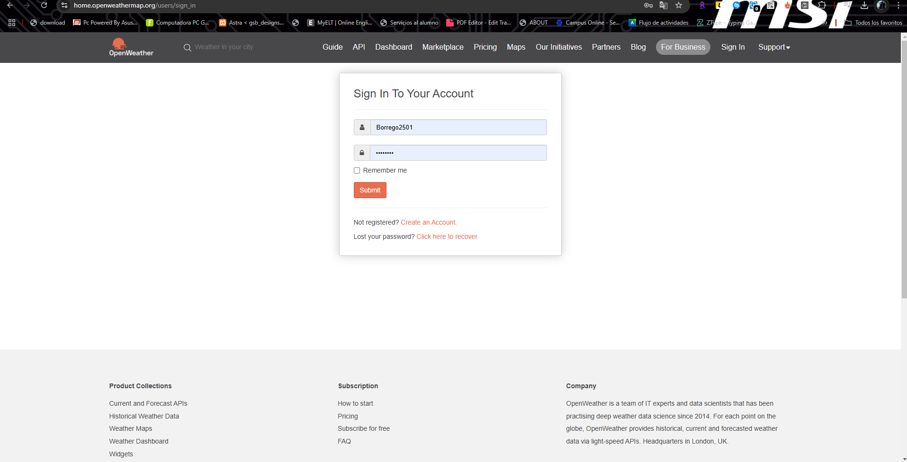
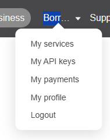
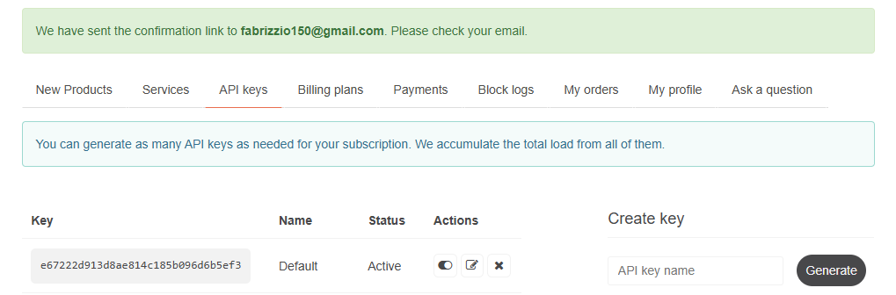

# How to Make a Request to the OpenWeather API

This tutorial explains how to make a request to the OpenWeather API using JavaScript. OpenWeather provides real-time weather data that you can integrate into your applications.

## Prerequisites

1. **OpenWeather Account**:
   - Sign up at [OpenWeather](https://openweathermap.org/) to access the API.
     
2. **API Key**:
   - Once registered, get your API Key from your dashboard.

     

     
     

## Building the API URL

The base URL for OpenWeather to fetch current weather data is:

 https://api.openweathermap.org/data/2.5/weather?q=Lima&appid=YOUR_API_KEY&units=metric&lang=es
### Common API Parameters:
1. **`q`**: Name of the city you want to query (e.g., `q=Lima`).
2. **`appid`**: Your personal API Key.
3. **`units`**: Temperature unit system:
   - `metric` (Celsius)
   - `imperial` (Fahrenheit)
   - `standard` (Kelvin, default).
4. **`lang`** (optional): Language for weather descriptions (e.g., `lang=en` for English).

### Example of a Customized URL:
To fetch the weather for Lima in Celsius and in Spanish:

Replace `YOUR_API_KEY` with your actual API Key.

---

## Example Code with `fetch`

This example makes a request to the API and logs the data to the console:

```javascript
const apiKey = "YOUR_API_KEY"; // Replace with your API Key
const city = "Lima"; // City to query
const apiUrl = `https://api.openweathermap.org/data/2.5/weather?q=${city}&appid=${apiKey}&units=metric&lang=en`;

const getWeather = async () => {
  try {
    const response = await fetch(apiUrl);
    if (!response.ok) {
      throw new Error(`Error: ${response.status}`);
    }
    const data = await response.json();
    console.log("Weather data:", data);

    // Example: Display results
    console.log(`Temperature in ${city}: ${data.main.temp}°C`);
    console.log(`Description: ${data.weather[0].description}`);
  } catch (error) {
    console.error("There was a problem with the request:", error.message);
  }
};

// Call the function
getWeather();


